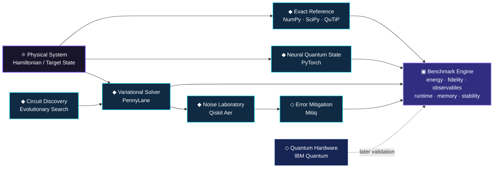
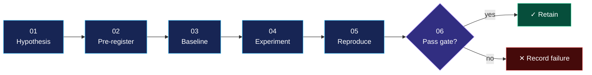

<div align="center">

<br>

# ⚛️ Quantum Advantage Simulator

### **A reproducible research environment for learning, simulating, approximating, and optimising quantum systems.**

<br>

[](#-current-research-status)
[](#-scope--claims-boundary)
[](#-research-contract)
[](https://www.python.org/)
[](#-validation)
[](#-status--license)

<br>

> ### **Exact physics where possible. Learned approximations where useful. Quantum hardware where justified.**

<sub>
No benchmark is presented as evidence of quantum advantage unless the experiment actually supports that conclusion.
</sub>

<br>

</div>

---

## ◈ Mission

**Quantum Advantage Simulator — QAS** is an experimental quantum-computing research platform built around one principle:

> **Every interesting quantum-AI result must survive comparison against a trusted classical baseline.**

The project studies how exact simulation, neural quantum states, variational quantum algorithms, noise mitigation, and automated circuit search behave under the **same reproducible benchmark framework**.

Rather than beginning with large claims, QAS begins with systems small enough to solve correctly.

From there, each method must earn its place through measurement.

---

## ◈ The research question

Modern quantum-computing research frequently combines several powerful ideas:

* classical quantum simulation,
* differentiable quantum circuits,
* neural representations of quantum states,
* hybrid quantum-classical optimisation,
* error mitigation,
* and automated circuit design.

Individually, each technique is useful.

QAS asks what happens when they are evaluated together under controlled conditions:

> **When does a learned, variational, mitigated, or automatically discovered quantum method become genuinely useful compared with the strongest practical classical baseline available at the same scale?**

The project does **not** assume that a quantum or AI-assisted method wins.

The experiment decides.

---

# ◈ System map



The **exact solver remains the reference** while the system is small enough for exact computation.

Neural and variational methods are judged against it—not against themselves.

---

# ◈ Research tracks

|     | Track                        | Research role                                   | Initial target              |
| :-: | ---------------------------- | ----------------------------------------------- | --------------------------- |
|  ⚛️ | **Exact Quantum Simulation** | Establish trusted numerical truth               | TFIM + Heisenberg           |
|  🧠 | **Neural Quantum States**    | Learn compact state representations             | RBM → autoregressive NQS    |
|  🔁 | **Variational Algorithms**   | Study trainable quantum circuits                | VQE → QAOA                  |
| 🌫️ | **Noise & Mitigation**       | Measure robustness under realistic noise        | ZNE + configurable noise    |
|  🧬 | **Circuit Discovery**        | Automatically search quantum programs           | Evolutionary circuit search |
| 🖥️ | **Hardware Validation**      | Compare simulation with real QPU execution      | Selected IBM Quantum runs   |
|  📊 | **Benchmarking**             | Evaluate every method under one metric contract | Accuracy + cost + stability |

---

# ◈ The first locked experiment

The project begins with a deliberately constrained system:

## Transverse-Field Ising Model

$$
H =
-J\sum_{i} Z_i Z_{i+1}
-h\sum_{i} X_i
$$

The first benchmark compares three independent approaches.

### 01 — Exact diagonalisation

Trusted reference solution using:

* NumPy
* SciPy
* QuTiP

Produces the reference:

$$
E_0,\qquad |\psi_0\rangle
$$

---

### 02 — Neural Quantum State

A PyTorch model learns an approximation:

$$
|\psi_{\theta}\rangle \approx |\psi_0\rangle
$$

Initial architecture:

**Restricted Boltzmann Machine**

followed later by:

**Autoregressive neural quantum states**

---

### 03 — Variational Quantum Eigensolver

A parameterised circuit prepares

$$
|\psi(\theta)\rangle
$$

and minimises

$$
E(\theta)
=
\langle\psi(\theta)|H|\psi(\theta)\rangle
$$

using PennyLane and classical optimisation.

---

## Phase-1 comparison

```text
                    ┌──────────────────────┐
                    │      TFIM Model      │
                    │      n = 2 ... 8     │
                    └──────────┬───────────┘
                               │
              ┌────────────────┼────────────────┐
              │                │                │
              ▼                ▼                ▼
      Exact Solver          RBM / NQS          VQE
      NumPy/QuTiP           PyTorch          PennyLane
              │                │                │
              └────────────────┼────────────────┘
                               ▼
                     Scientific Benchmark
                               │
          ┌────────────────────┼────────────────────┐
          ▼                    ▼                    ▼
        Energy              Fidelity           Observables
          │                    │                    │
          └────────────────────┼────────────────────┘
                               ▼
                     Runtime / Memory /
                       Seed Stability
```

---

# ◈ Success is not “the loss went down”

A run only counts if it passes predefined scientific checks.

| Metric                        | What it tests                                                  |
| ----------------------------- | -------------------------------------------------------------- |
| **Ground-state energy error** | Whether the estimated energy matches the exact solution        |
| **Relative energy error**     | Accuracy independent of absolute energy scale                  |
| **State fidelity**            | Whether the predicted wavefunction matches the reference state |
| **Magnetisation error**       | Whether physical observables remain correct                    |
| **Runtime**                   | Computational cost                                             |
| **Peak memory**               | Resource scaling                                               |
| **Seed variance**             | Optimisation stability                                         |
| **Convergence behaviour**     | Whether optimisation reliably reaches the same region          |

For predicted and exact states,

$$
F =
|\langle \psi_{\text{exact}}
|
\psi_{\text{predicted}}\rangle|^2
$$

is one of the core Phase-1 metrics.

---

# ◈ Research contract

Every experiment in QAS follows the same lifecycle.



### Every registered experiment defines

**Hypothesis**

What exactly should improve?

**Baseline**

What is the cheapest conventional method capable of producing an apparent win?

**Controlled variables**

* qubit count,
* Hamiltonian parameters,
* optimiser,
* circuit depth,
* random seeds,
* training budget,
* shot budget,
* stopping conditions.

**Primary metrics**

Specified before execution.

**Pass/fail condition**

Specified before looking at final results.

**Artifacts**

Enough information must be stored to reproduce the run.

---

# ◈ Evidence levels

QAS distinguishes clearly between implementation, measurement, and research claims.

| Level         | Meaning                                     |
| ------------- | ------------------------------------------- |
| `BUILD`       | Method exists and executes                  |
| `VALIDATED`   | Method passes correctness checks            |
| `REPRODUCED`  | Result survives repeated seeds/runs         |
| `BENCHMARKED` | Compared against named baselines            |
| `SUPPORTED`   | Evidence supports the registered hypothesis |

A feature being implemented does **not** imply its research hypothesis is supported.

---

# ◈ Validation

Scientific software can produce completely valid-looking nonsense.

QAS therefore tests both **software behaviour** and **physical invariants**.

Examples include:

```text
Hamiltonian Hermiticity
Ground-state normalization
Eigenvalue ordering
State normalization
Probability conservation
Observable bounds
Deterministic seeded execution
Exact-solver consistency
Energy expectation sanity checks
```

Tests live under:

```text
tests/
```

and are intended to grow alongside the research code.

---

# ◈ Roadmap

## Phase I — Validated Foundation

**Months 1–3**

Build the scientific reference layer.

* exact TFIM solver
* exact Heisenberg solver
* RBM neural quantum state
* autoregressive NQS exploration
* PennyLane VQE
* 2–8 qubit benchmarks
* seeded experiments
* reproducibility tests
* energy, fidelity, observable and resource measurements

### Gate

> NQS and VQE must reproduce known small-system behaviour within predefined tolerances.

---

## Phase II — Variational + Noise Laboratory

**Months 4–6**

Expand the benchmark environment.

* VQE on TFIM
* VQE on small molecular Hamiltonians
* QAOA on MaxCut
* ansatz comparisons
* optimiser comparisons
* depolarising noise
* bit-flip noise
* readout noise
* zero-noise extrapolation
* mitigation overhead analysis

### Gate

> Demonstrate when mitigation improves an estimate and quantify the cost required to obtain that improvement.

---

## Phase III — Circuit Discovery

**Months 7–9**

Search quantum-program space automatically.

* restricted gate vocabulary
* evolutionary search
* state-target objectives
* observable-target objectives
* fidelity/depth/gate-count fitness
* random-search baseline
* human-designed circuit baseline
* optional reinforcement-learning experiments
* selected real-QPU validation

### Gate

> Discover at least one circuit that beats a registered baseline under the same search and resource budget.

---

## Phase IV — Benchmark Platform

**Months 10–12**

Turn the research framework into a complete experimental system.

* unified benchmark runner
* experiment registry
* artifact tracking
* reproducible configuration files
* interactive results dashboard
* API
* comparison visualisations
* hardware experiment support
* final technical documentation

A research paper is written **only if the experiments produce a result worth publishing**.

---

# ◈ Long-term research direction

If the foundation works, QAS can progressively investigate:

### Neural representations

Can neural quantum states represent relevant systems using fewer computational resources than exact state-vector representations?

### Variational efficiency

Which circuit structures reach useful solutions with minimal depth and optimisation instability?

### Error mitigation

At what noise level does mitigation stop producing enough improvement to justify its sampling overhead?

### Automated discovery

Can search methods find smaller circuits than manually designed alternatives?

### Quantum advantage indicators

At what scale do classical exact solvers begin losing practicality while approximate or hardware-assisted methods remain useful?

These are **research questions**, not predetermined conclusions.

---

# ◈ Scope & claims boundary

## What QAS can investigate

* small quantum spin systems
* exact state-vector calculations
* neural approximations
* small molecular Hamiltonians
* variational circuits
* noise models
* mitigation methods
* quantum optimisation examples
* automatic circuit search
* selected QPU execution

## What QAS does **not** currently claim

* quantum supremacy
* experimentally proven quantum advantage
* simulation beyond classical computational limits
* industrial-scale molecular discovery
* fault-tolerant quantum computing
* large-scale FeMoco simulation
* quantum-gravity simulation
* production-ready quantum algorithms

The intended working range is approximately:

```text
2–8 qubits     → strict validation regime

8–20 qubits    → scaling and approximation experiments

larger systems → method dependent; no guaranteed exact simulation
```

---

# ◈ Technology stack

<table>
<tr>
<td width="33%" valign="top">

### ⚛️ Quantum

* PennyLane
* Qiskit Aer
* QuTiP
* IBM Quantum

</td>
<td width="33%" valign="top">

### 🧠 Machine Learning

* PyTorch
* NumPy
* SciPy
* CUDA

</td>
<td width="33%" valign="top">

### 🧪 Research Platform

* FastAPI
* React
* Vite
* Plotly

</td>
</tr>
</table>

### Method-specific tooling

| Requirement               | Primary tool          |
| ------------------------- | --------------------- |
| Exact diagonalisation     | NumPy / SciPy / QuTiP |
| Differentiable circuits   | PennyLane             |
| Neural quantum states     | PyTorch               |
| Circuit simulation        | Qiskit Aer            |
| Noise simulation          | Qiskit Aer            |
| Error mitigation          | Mitiq                 |
| Classical optimisation    | SciPy                 |
| Hardware experiments      | IBM Quantum           |
| GPU acceleration          | PyTorch / CUDA        |
| Distributed experiments   | MPI — later           |
| Experiment API            | FastAPI               |
| Interactive visualisation | Plotly                |

---

# ◈ Repository architecture

```text
quantum-advantage-simulator/
│
├── src/
│   └── qas/
│       ├── exact/                 # exact quantum solvers
│       ├── nqs/                   # neural quantum states
│       ├── variational/           # VQE / QAOA
│       ├── noise/                 # noise models
│       ├── mitigation/            # mitigation methods
│       ├── discovery/             # circuit search
│       ├── benchmarks/            # evaluation framework
│       └── utils/
│
├── experiments/
│   ├── configs/                   # immutable run configs
│   └── registry.yaml              # registered experiments
│
├── tests/
│   ├── unit/
│   └── scientific/
│
├── results/
│   ├── tables/
│   ├── figures/
│   └── runs/
│
├── docs/
│   ├── ROADMAP.md
│   └── METHODOLOGY.md
│
├── pyproject.toml
├── LICENSE
└── README.md
```

---

# ◈ Experiment artifacts

Every serious run should eventually produce a self-contained artifact directory.

```text
results/runs/<experiment-id>/
│
├── config.yaml
├── environment.json
├── metrics.json
├── summary.csv
├── stdout.log
├── checkpoints/
├── figures/
└── verdict.md
```

A result without enough information to reproduce it is not considered a finished experiment.

---

# ◈ Current research status

### Foundation

| Component                  |      Status      |
| -------------------------- | :--------------: |
| Research scope             |     ✅ Locked     |
| Claims policy              |     ✅ Locked     |
| 12-month roadmap           |     ✅ Locked     |
| Research methodology       |   ✅ Established  |
| Experiment registry        |     ✅ Created    |
| Repository architecture    |     ✅ Created    |
| TFIM Hamiltonian           |   ✅ Implemented  |
| Ground-state solver        |   ✅ Implemented  |
| Scientific invariant tests |     ✅ Passing    |
| Environment lock           |   ◐ In progress  |
| Complete TFIM validation   |     ○ Pending    |
| RBM NQS                    |     ○ Pending    |
| VQE benchmark              |     ○ Pending    |
| Multi-seed evaluation      |     ○ Pending    |
| Phase-1 result             | ○ Not yet earned |

---

## No headline result yet

> [!NOTE]
> QAS is currently in its **foundation phase**.
>
> No claim of superior performance, neural advantage, variational advantage, or quantum advantage has been established.
>
> The first meaningful result will be the completed **TFIM Exact vs NQS vs VQE benchmark**.

---

# ◈ What comes next

```text
Exact TFIM
    ↓
RBM Neural Quantum State
    ↓
VQE Baseline
    ↓
2–8 Qubit Benchmark
    ↓
Multi-Seed Reproduction
    ↓
Phase-1 Verdict
```

Everything else waits until this sequence is complete.

---

# ◈ Research principles

### 01. Exact before approximate

If the system can still be solved exactly, approximate methods must be validated against the exact answer.

### 02. Baseline before claim

Every improvement requires a named comparison.

### 03. Metrics before results

Success criteria are defined before final measurements are inspected.

### 04. Reproduction before conclusion

One successful seed is not evidence.

### 05. Failures remain visible

A failed experiment changes the research direction; it is not deleted from the scientific record.

### 06. Scaling claims require scaling measurements

Performance measured at eight qubits says nothing automatically about eighty.

---

# ◈ Long-horizon objective

QAS is ultimately intended to become a unified environment in which a researcher can:

```text
Define a quantum system
        ↓
Solve it exactly where possible
        ↓
Train a neural approximation
        ↓
Optimise a variational circuit
        ↓
Inject realistic noise
        ↓
Apply mitigation
        ↓
Search alternative circuits
        ↓
Execute selected cases on hardware
        ↓
Compare every approach under one benchmark
```

The long-term value of the project is not one algorithm.

It is the **experimental framework that makes competing approaches comparable**.

---

# ◈ Status & license

**Private research repository.**

This repository contains original research code, experiments, methodology, benchmark infrastructure, and associated documentation.

**All rights reserved.**

No permission is granted to copy, reproduce, redistribute, publish, sublicense, commercially exploit, or create derivative works from this repository without explicit written authorization from the repository owner.

See [`LICENSE`](LICENSE) for the complete terms.

---

<div align="center">

### ⚛️ Quantum Advantage Simulator

**Measure first. Claim second.**

<sub>
Exact simulation · Neural quantum states · Variational algorithms · Noise mitigation · Circuit discovery
</sub>

<br><br>

`research status: foundation`

</div>
