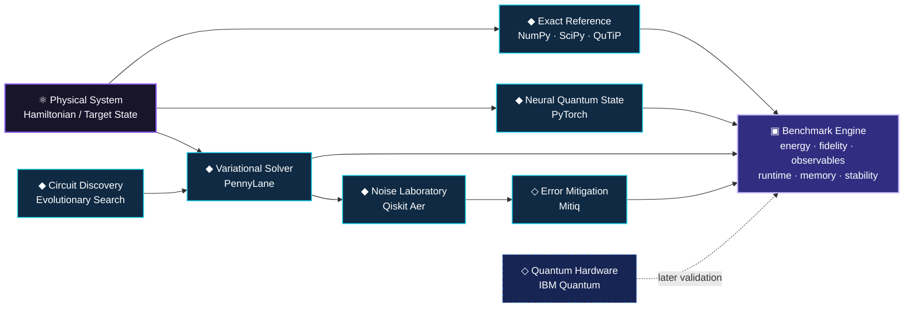
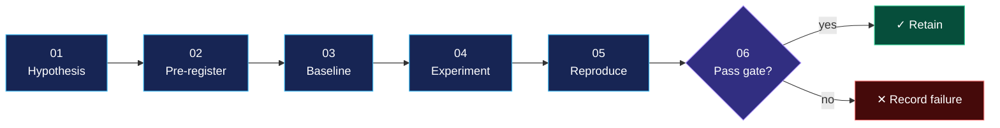

<div align="center">

<br>

# ⚛️ Quantum Advantage Simulator

### A reproducible research environment for learning, simulating, approximating, and optimising quantum systems

<br>

[](#current-research-status)
[](#scope--claims-boundary)
[](#research-contract)
[](https://www.python.org/)
[](#validation)
[](#status--license)

<br>

> ### Exact physics where possible. Learned approximations where useful. Quantum hardware where justified.

<sub>No benchmark is presented as evidence of quantum advantage unless the experiment actually supports that conclusion.</sub>

</div>

---

## Table of Contents

- [Mission](#mission)
- [The Research Question](#the-research-question)
- [System Map](#system-map)
- [Research Tracks](#research-tracks)
- [The First Locked Experiment](#the-first-locked-experiment)
- [Success Criteria](#success-is-not-the-loss-went-down)
- [Research Contract](#research-contract)
- [Evidence Levels](#evidence-levels)
- [Validation](#validation)
- [Roadmap](#roadmap)
- [Long-Term Research Direction](#long-term-research-direction)
- [Scope & Claims Boundary](#scope--claims-boundary)
- [Technology Stack](#technology-stack)
- [Repository Architecture](#repository-architecture)
- [Experiment Artifacts](#experiment-artifacts)
- [Current Research Status](#current-research-status)
- [What Comes Next](#what-comes-next)
- [Research Principles](#research-principles)
- [Long-Horizon Objective](#long-horizon-objective)
- [Status & License](#status--license)

---

## Mission

**Quantum Advantage Simulator (QAS)** is an experimental quantum-computing research platform built around one principle:

> **Every interesting quantum-AI result must survive comparison against a trusted classical baseline.**

The project studies how exact simulation, neural quantum states, variational quantum algorithms, noise mitigation, and automated circuit search behave under the **same reproducible benchmark framework**.

Rather than beginning with large claims, QAS begins with systems small enough to solve correctly. From there, each method must earn its place through measurement.

---

## The Research Question

Modern quantum-computing research frequently combines several powerful ideas:

- classical quantum simulation
- differentiable quantum circuits
- neural representations of quantum states
- hybrid quantum-classical optimisation
- error mitigation
- automated circuit design

Individually, each technique is useful. QAS asks what happens when they are evaluated together under controlled conditions:

> **When does a learned, variational, mitigated, or automatically discovered quantum method become genuinely useful compared with the strongest practical classical baseline available at the same scale?**

The project does **not** assume that a quantum or AI-assisted method wins. **The experiment decides.**

---

## System Map



The **exact solver remains the reference** while the system is small enough for exact computation. Neural and variational methods are judged against it — not against themselves.

---

## Research Tracks

|     | Track                     | Research Role                                   | Initial Target               |
| :-: | -------------------------- | ------------------------------------------------ | ------------------------------ |
| ⚛️  | **Exact Quantum Simulation** | Establish trusted numerical truth               | TFIM + Heisenberg              |
| 🧠  | **Neural Quantum States**    | Learn compact state representations             | RBM → autoregressive NQS       |
| 🔁  | **Variational Algorithms**   | Study trainable quantum circuits                | VQE → QAOA                     |
| 🌫️  | **Noise & Mitigation**       | Measure robustness under realistic noise        | ZNE + configurable noise       |
| 🧬  | **Circuit Discovery**        | Automatically search quantum programs           | Evolutionary circuit search    |
| 🖥️  | **Hardware Validation**      | Compare simulation with real QPU execution      | Selected IBM Quantum runs      |
| 📊  | **Benchmarking**             | Evaluate every method under one metric contract | Accuracy + cost + stability    |

---

## The First Locked Experiment

The project begins with a deliberately constrained system: the **Transverse-Field Ising Model**.

$$
H = -J\sum_{i} Z_i Z_{i+1} - h\sum_{i} X_i
$$

The first benchmark compares three independent approaches.

### 01 — Exact Diagonalisation

Trusted reference solution using **NumPy**, **SciPy**, and **QuTiP**. Produces the reference:

$$
E_0, \qquad |\psi_0\rangle
$$

### 02 — Neural Quantum State

A PyTorch model learns an approximation:

$$
|\psi_{\theta}\rangle \approx |\psi_0\rangle
$$

Initial architecture: **Restricted Boltzmann Machine**, followed later by **autoregressive neural quantum states**.

### 03 — Variational Quantum Eigensolver

A parameterised circuit prepares $|\psi(\theta)\rangle$ and minimises

$$
E(\theta) = \langle\psi(\theta)|H|\psi(\theta)\rangle
$$

using PennyLane and classical optimisation.

### Phase-1 Comparison

```text
                    ┌──────────────────────┐
                    │      TFIM Model      │
                    │      n = 2 ... 8     │
                    └──────────┬───────────┘
                               │
              ┌────────────────┼────────────────┐
              │                │                │
              ▼                ▼                ▼
      Exact Solver          RBM / NQS          VQE
      NumPy/QuTiP           PyTorch          PennyLane
              │                │                │
              └────────────────┼────────────────┘
                               ▼
                     Scientific Benchmark
                               │
          ┌────────────────────┼────────────────────┐
          ▼                    ▼                    ▼
        Energy              Fidelity           Observables
          │                    │                    │
          └────────────────────┼────────────────────┘
                               ▼
                     Runtime / Memory /
                       Seed Stability
```

---

## Success Is Not "the Loss Went Down"

A run only counts if it passes predefined scientific checks.

| Metric                        | What It Tests                                                   |
| ------------------------------ | ----------------------------------------------------------------- |
| **Ground-state energy error**  | Whether the estimated energy matches the exact solution         |
| **Relative energy error**      | Accuracy independent of absolute energy scale                   |
| **State fidelity**             | Whether the predicted wavefunction matches the reference state  |
| **Magnetisation error**        | Whether physical observables remain correct                     |
| **Runtime**                    | Computational cost                                               |
| **Peak memory**                | Resource scaling                                                  |
| **Seed variance**              | Optimisation stability                                            |
| **Convergence behaviour**      | Whether optimisation reliably reaches the same region            |

For predicted and exact states, fidelity is defined as:

$$
F = |\langle \psi_{\text{exact}} | \psi_{\text{predicted}} \rangle|^2
$$

This is one of the core Phase-1 metrics.

---

## Research Contract

Every experiment in QAS follows the same lifecycle.



Every registered experiment defines:

| Element                  | Description                                                                                                                    |
| ------------------------- | -------------------------------------------------------------------------------------------------------------------------------- |
| **Hypothesis**            | What exactly should improve?                                                                                                   |
| **Baseline**              | The cheapest conventional method capable of producing an apparent win                                                          |
| **Controlled variables**  | Qubit count, Hamiltonian parameters, optimiser, circuit depth, random seeds, training budget, shot budget, stopping conditions |
| **Primary metrics**       | Specified before execution                                                                                                     |
| **Pass/fail condition**   | Specified before looking at final results                                                                                      |
| **Artifacts**             | Enough information to reproduce the run                                                                                        |

---

## Evidence Levels

QAS distinguishes clearly between implementation, measurement, and research claims.

| Level          | Meaning                                       |
| --------------- | ------------------------------------------------ |
| `BUILD`         | Method exists and executes                     |
| `VALIDATED`     | Method passes correctness checks               |
| `REPRODUCED`    | Result survives repeated seeds/runs            |
| `BENCHMARKED`   | Compared against named baselines               |
| `SUPPORTED`     | Evidence supports the registered hypothesis    |

A feature being implemented does **not** imply its research hypothesis is supported.

---

## Validation

Scientific software can produce completely valid-looking nonsense. QAS therefore tests both **software behaviour** and **physical invariants**, including:

- Hamiltonian Hermiticity
- Ground-state normalization
- Eigenvalue ordering
- State normalization
- Probability conservation
- Observable bounds
- Deterministic seeded execution
- Exact-solver consistency
- Energy expectation sanity checks

Tests live under `tests/` and are intended to grow alongside the research code.

---

## Roadmap

### Phase I — Validated Foundation *(Months 1–3)*

Build the scientific reference layer:

- Exact TFIM solver
- Exact Heisenberg solver
- RBM neural quantum state
- Autoregressive NQS exploration
- PennyLane VQE
- 2–8 qubit benchmarks
- Seeded experiments
- Reproducibility tests
- Energy, fidelity, observable, and resource measurements

**Gate:** NQS and VQE must reproduce known small-system behaviour within predefined tolerances.

### Phase II — Variational + Noise Laboratory *(Months 4–6)*

Expand the benchmark environment:

- VQE on TFIM
- VQE on small molecular Hamiltonians
- QAOA on MaxCut
- Ansatz comparisons
- Optimiser comparisons
- Depolarising, bit-flip, and readout noise
- Zero-noise extrapolation
- Mitigation overhead analysis

**Gate:** Demonstrate when mitigation improves an estimate and quantify the cost required to obtain that improvement.

### Phase III — Circuit Discovery *(Months 7–9)*

Search quantum-program space automatically:

- Restricted gate vocabulary
- Evolutionary search
- State-target and observable-target objectives
- Fidelity / depth / gate-count fitness
- Random-search baseline
- Human-designed circuit baseline
- Optional reinforcement-learning experiments
- Selected real-QPU validation

**Gate:** Discover at least one circuit that beats a registered baseline under the same search and resource budget.

### Phase IV — Benchmark Platform *(Months 10–12)*

Turn the research framework into a complete experimental system:

- Unified benchmark runner
- Experiment registry
- Artifact tracking
- Reproducible configuration files
- Interactive results dashboard
- API
- Comparison visualisations
- Hardware experiment support
- Final technical documentation

A research paper is written **only if the experiments produce a result worth publishing**.

---

## Long-Term Research Direction

If the foundation works, QAS can progressively investigate:

| Direction                       | Question                                                                                                       |
| --------------------------------- | ------------------------------------------------------------------------------------------------------------------ |
| **Neural representations**       | Can neural quantum states represent relevant systems using fewer computational resources than exact state-vector representations? |
| **Variational efficiency**       | Which circuit structures reach useful solutions with minimal depth and optimisation instability?               |
| **Error mitigation**             | At what noise level does mitigation stop producing enough improvement to justify its sampling overhead?         |
| **Automated discovery**          | Can search methods find smaller circuits than manually designed alternatives?                                  |
| **Quantum advantage indicators** | At what scale do classical exact solvers begin losing practicality while approximate or hardware-assisted methods remain useful? |

These are **research questions**, not predetermined conclusions.

---

## Scope & Claims Boundary

**What QAS can investigate:**

- Small quantum spin systems
- Exact state-vector calculations
- Neural approximations
- Small molecular Hamiltonians
- Variational circuits
- Noise models and mitigation methods
- Quantum optimisation examples
- Automatic circuit search
- Selected QPU execution

**What QAS does *not* currently claim:**

- Quantum supremacy
- Experimentally proven quantum advantage
- Simulation beyond classical computational limits
- Industrial-scale molecular discovery
- Fault-tolerant quantum computing
- Large-scale FeMoco simulation
- Quantum-gravity simulation
- Production-ready quantum algorithms

**Intended working range:**

| Scale             | Regime                                        |
| ------------------ | ------------------------------------------------ |
| 2–8 qubits         | Strict validation regime                       |
| 8–20 qubits        | Scaling and approximation experiments          |
| Larger systems     | Method-dependent; no guaranteed exact simulation |

---

## Technology Stack

| Domain                     | Tools                              |
| ---------------------------- | ------------------------------------- |
| ⚛️ **Quantum**               | PennyLane, Qiskit Aer, QuTiP, IBM Quantum |
| 🧠 **Machine Learning**      | PyTorch, NumPy, SciPy, CUDA        |
| 🧪 **Research Platform**     | FastAPI, React, Vite, Plotly       |

### Method-Specific Tooling

| Requirement                | Primary Tool           |
| ---------------------------- | ------------------------- |
| Exact diagonalisation       | NumPy / SciPy / QuTiP   |
| Differentiable circuits     | PennyLane               |
| Neural quantum states       | PyTorch                 |
| Circuit simulation          | Qiskit Aer               |
| Noise simulation            | Qiskit Aer               |
| Error mitigation            | Mitiq                    |
| Classical optimisation      | SciPy                    |
| Hardware experiments        | IBM Quantum               |
| GPU acceleration            | PyTorch / CUDA          |
| Distributed experiments     | MPI *(later)*            |
| Experiment API               | FastAPI                  |
| Interactive visualisation    | Plotly                   |

---

## Repository Architecture

```text
quantum-advantage-simulator/
│
├── src/
│   └── qas/
│       ├── exact/                 # exact quantum solvers
│       ├── nqs/                   # neural quantum states
│       ├── variational/           # VQE / QAOA
│       ├── noise/                 # noise models
│       ├── mitigation/            # mitigation methods
│       ├── discovery/             # circuit search
│       ├── benchmarks/            # evaluation framework
│       └── utils/
│
├── experiments/
│   ├── configs/                   # immutable run configs
│   └── registry.yaml              # registered experiments
│
├── tests/
│   ├── unit/
│   └── scientific/
│
├── results/
│   ├── tables/
│   ├── figures/
│   └── runs/
│
├── docs/
│   ├── ROADMAP.md
│   └── METHODOLOGY.md
│
├── pyproject.toml
├── LICENSE
└── README.md
```

---

## Experiment Artifacts

Every serious run should eventually produce a self-contained artifact directory:

```text
results/runs/<experiment-id>/
│
├── config.yaml
├── environment.json
├── metrics.json
├── summary.csv
├── stdout.log
├── checkpoints/
├── figures/
└── verdict.md
```

A result without enough information to reproduce it is not considered a finished experiment.

---

## Current Research Status

### Foundation

| Component                     | Status              |
| -------------------------------- | :--------------------: |
| Research scope                 | ✅ Locked             |
| Claims policy                  | ✅ Locked             |
| 12-month roadmap               | ✅ Locked             |
| Research methodology           | ✅ Established        |
| Experiment registry            | ✅ Created            |
| Repository architecture        | ✅ Created            |
| TFIM Hamiltonian               | ✅ Implemented        |
| Ground-state solver            | ✅ Implemented        |
| Scientific invariant tests     | ✅ Passing            |
| Environment lock                | ◐ In progress         |
| Complete TFIM validation       | ○ Pending             |
| RBM NQS                        | ○ Pending             |
| VQE benchmark                  | ○ Pending             |
| Multi-seed evaluation          | ○ Pending             |
| Phase-1 result                 | ○ Not yet earned      |

> [!NOTE]
> QAS is currently in its **foundation phase**. No claim of superior performance, neural advantage, variational advantage, or quantum advantage has been established. The first meaningful result will be the completed **TFIM Exact vs. NQS vs. VQE benchmark**.

---

## What Comes Next

```text
Exact TFIM
    ↓
RBM Neural Quantum State
    ↓
VQE Baseline
    ↓
2–8 Qubit Benchmark
    ↓
Multi-Seed Reproduction
    ↓
Phase-1 Verdict
```

Everything else waits until this sequence is complete.

---

## Research Principles

| # | Principle                          | Description                                                                      |
| - | ------------------------------------ | ------------------------------------------------------------------------------------ |
| 01 | **Exact before approximate**        | If the system can still be solved exactly, approximate methods must be validated against the exact answer. |
| 02 | **Baseline before claim**           | Every improvement requires a named comparison.                                    |
| 03 | **Metrics before results**          | Success criteria are defined before final measurements are inspected.             |
| 04 | **Reproduction before conclusion**  | One successful seed is not evidence.                                              |
| 05 | **Failures remain visible**         | A failed experiment changes the research direction; it is not deleted from the scientific record. |
| 06 | **Scaling claims require scaling measurements** | Performance measured at eight qubits says nothing automatically about eighty. |

---

## Long-Horizon Objective

QAS is ultimately intended to become a unified environment in which a researcher can:

```text
Define a quantum system
        ↓
Solve it exactly where possible
        ↓
Train a neural approximation
        ↓
Optimise a variational circuit
        ↓
Inject realistic noise
        ↓
Apply mitigation
        ↓
Search alternative circuits
        ↓
Execute selected cases on hardware
        ↓
Compare every approach under one benchmark
```

The long-term value of the project is not one algorithm. It is the **experimental framework that makes competing approaches comparable**.

---

## Status & License

**Private research repository.**

This repository contains original research code, experiments, methodology, benchmark infrastructure, and associated documentation.

**All rights reserved.** No permission is granted to copy, reproduce, redistribute, publish, sublicense, commercially exploit, or create derivative works from this repository without explicit written authorization from the repository owner. See [`LICENSE`](LICENSE) for the complete terms.

---

<div align="center">

### ⚛️ Quantum Advantage Simulator

**Measure first. Claim second.**

<sub>Exact simulation · Neural quantum states · Variational algorithms · Noise mitigation · Circuit discovery</sub>

<br>

`research status: foundation`

</div>
