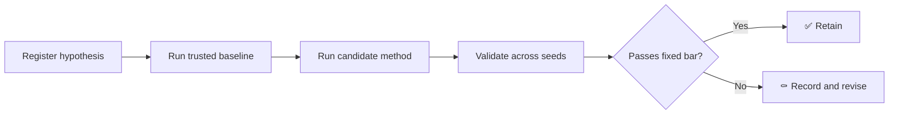

<div align="center">

# ⚛️ Quantum Advantage Simulator

**An evidence-first research platform for exact quantum simulation, neural quantum states, variational algorithms, noise mitigation, and automated circuit discovery.**


</div>

> [!IMPORTANT]
> This is an active research repository. It does **not** claim quantum advantage, quantum supremacy, industrial drug discovery, or classically intractable simulation. Every claim must be tied to a reproducible experiment, a named baseline, and stored run artifacts.

---

## What this is

Quantum Advantage Simulator (QAS) is a hybrid quantum–classical experimentation platform. It brings five research tracks into one reproducible system:

| | Track | Initial objective |
|---|---|---|
| 🧮 | **Exact simulation** | Produce trusted reference results for small spin systems |
| 🧠 | **Neural quantum states** | Approximate ground states with RBM/autoregressive models |
| 🔁 | **Variational algorithms** | Evaluate VQE and QAOA under controlled baselines |
| 🌫️ | **Noise mitigation** | Quantify when mitigation improves noisy estimates and at what cost |
| 🧬 | **Circuit discovery** | Search for compact circuits that reproduce target states or observables |

The first scientific target is deliberately narrow:

> **Compare exact diagonalisation, a neural quantum state, and VQE on the transverse-field Ising model across 2–8 qubits.**

---

## Research discipline



Every experiment must define:

1. The hypothesis and pass/fail criterion before execution.
2. The cheapest baseline capable of producing an apparent win.
3. Fixed datasets, Hamiltonians, seeds, budgets, and stopping rules.
4. Accuracy, resource usage, and stability metrics.
5. Raw results sufficient to reproduce every reported table or figure.

Negative results stay in the repository. A failed method is evidence, not an embarrassment.

---

## Phase 1 experiment

### System

Transverse-field Ising model:

$$
H = -J\sum_i Z_i Z_{i+1} - h\sum_i X_i
$$

### Methods

- Exact diagonalisation using NumPy/SciPy or QuTiP
- Restricted Boltzmann machine neural quantum state using PyTorch
- Variational quantum eigensolver using PennyLane

### Primary metrics

| Metric | Purpose |
|---|---|
| Ground-state energy error | Accuracy against the exact solver |
| State fidelity | Similarity to the exact ground state |
| Magnetisation error | Physical-observable agreement |
| Runtime | Computational cost |
| Peak memory | Scaling behaviour |
| Seed variance | Optimisation stability |

The experiment is not considered successful merely because loss decreases.

---

## Repository layout

```text
quantum-advantage-simulator/
├── src/qas/                 # Reusable research package
├── tests/                   # Unit and scientific-invariant tests
├── experiments/
│   ├── configs/              # Versioned experiment configurations
│   └── registry.yaml         # Pre-registered runs and verdicts
├── results/                 # Run artifacts; large outputs stay untracked
├── docs/
│   ├── ROADMAP.md
│   └── METHODOLOGY.md
├── pyproject.toml
└── README.md
```

---

## Roadmap

| Phase | Months | Deliverable |
|---|---:|---|
| Foundation | 1–3 | Validated TFIM exact/NQS/VQE benchmark |
| Core algorithms | 4–6 | VQE, QAOA, noise models, zero-noise extrapolation |
| Discovery | 7–9 | Restricted circuit search and selected hardware runs |
| Evaluation | 10–12 | Reproducible benchmark suite, dashboard, documentation |

See [`docs/ROADMAP.md`](docs/ROADMAP.md) for gates and non-goals.

---

## Toolchain

- **PennyLane** for differentiable quantum circuits
- **QuTiP / NumPy / SciPy** for trusted exact references
- **PyTorch** for neural quantum states
- **Qiskit Aer** for circuit and noise simulation
- **Mitiq** for error-mitigation experiments
- **IBM Quantum** for selected hardware validation
- **FastAPI + React/Plotly** for the later experiment dashboard

---

## Current status

- [x] Research scope bounded
- [x] Claims policy established
- [x] Phase 1 benchmark selected
- [ ] Development environment locked
- [ ] Exact TFIM solver validated
- [ ] RBM neural quantum state validated
- [ ] VQE baseline validated
- [ ] Multi-seed comparison completed

No performance claim has been earned yet.

---

## Status and license

Private research repository. All rights reserved. No permission is granted to copy, redistribute, publish, sublicense, or commercially use this work without written authorization from the repository owner. See [`LICENSE`](LICENSE).
