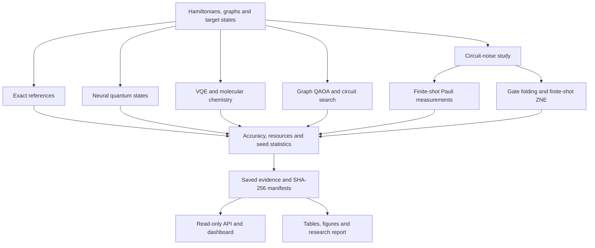
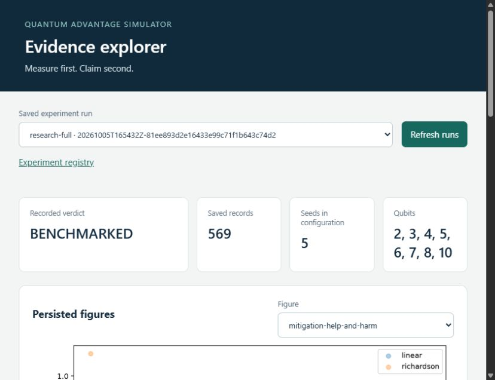

# Quantum Advantage Simulator

A reproducible framework for comparing classical exact simulation, neural quantum states, variational quantum algorithms, noise mitigation and automated circuit search.

**Exact where possible. Learned where useful. Quantum where justified.**

QAS does **not** assume quantum advantage. It measures whether an advantage exists under controlled, reproducible experiments. The released studies establish small-system comparisons and preserve negative results; they demonstrate no quantum advantage.

[](https://github.com/sreerevanth/quantum-advantage-simulator/releases/latest)
[](pyproject.toml)
[](https://github.com/sreerevanth/quantum-advantage-simulator/actions/workflows/ci.yml)
[](LICENSE)

| Release | Validation at v0.1.0 | Executed full suite | License |
|:---|:---|:---|:---|
| **[v0.1.0 · Released](https://github.com/sreerevanth/quantum-advantage-simulator/releases/tag/v0.1.0)** | [95 tests passing · 91% coverage](docs/VALIDATION.md) | **569 records** across seven studies | [Apache-2.0](LICENSE) |

[Results](#results-at-a-glance) · [Quick start](#quick-start) · [Dashboard](#dashboard) · [Research report](docs/FINAL_RESEARCH_REPORT.md) · [Downloads](#release-and-downloads)

## Why QAS?

When exact simulation, learned wavefunctions, variational circuits, noisy execution and automated search are evaluated in one reproducible framework, **where does each approach actually help?**

QAS makes that question testable on small systems. Exact references anchor accuracy; controlled variants expose sensitivity to initialization, ansatz and budget; saved configurations and checkpoints make the results inspectable. Failed optimizations and harmful mitigation outcomes remain part of the evidence.

## System overview


```mermaid
flowchart TD
    P[Hamiltonians, graphs and target states] --> R[Exact references]
    P --> N[Neural quantum states]
    P --> V[VQE and molecular chemistry]
    P --> Q[Graph QAOA and circuit search]
    P --> C[Circuit-noise study]
    C --> F[Finite-shot Pauli measurements]
    C --> Z[Gate folding and finite-shot ZNE]
    R --> M[Accuracy, resources and seed statistics]
    N --> M
    V --> M
    Q --> M
    F --> M
    Z --> M
    M --> E[Saved evidence and SHA-256 manifests]
    E --> D[Read-only API and dashboard]
    E --> T[Tables, figures and research report]
```

The branches are distinct studies. QAOA uses analytic optimization followed by a sampled evaluation; the mitigation study compares noisy raw and folded-circuit estimates. See the [architecture](docs/ARCHITECTURE.md) and [methodology](docs/METHODOLOGY.md).

## What QAS contains

| Area | Implemented scope |
|:---|:---|
| **References and learned states** | Dense TFIM/Heisenberg references; original positive RBM; complex autoregressive NQS with direct sampling, Adam/SGD and optimizer checkpoints. |
| **Variational algorithms** | VQE ansatz, depth, initialization, optimizer and restart comparisons; graph QAOA; four-spin-orbital H₂ in STO-3G. |
| **Measurements and mitigation** | Finite-shot Pauli estimates and variance; gate-level local noise and readout flips; folded linear/Richardson zero-noise extrapolation with shot accounting. |
| **Circuit discovery** | Random and evolutionary search with matched evaluation budgets, mutation/crossover, human baselines and Pareto archives. |
| **Experiment infrastructure** | Quick/full resumable suites, seed summaries, configuration and environment provenance, checkpoints and checksum verification. |
| **Execution and inspection** | CPU/CUDA selection, opt-in IBM submission/retrieval adapter, read-only evidence API and research dashboard. CUDA and IBM QPU runs were not executed for v0.1.0. |

[Implementation and execution status →](docs/IMPLEMENTATION_STATUS.md)

## Results at a glance

These are **executed v0.1.0 simulator results**, not projected performance. The full suite contains 45 NQS, 105 VQE, 240 mitigation, 120 QAOA, 30 discovery, 15 chemistry and 14 scaling records.

| Study | Finding | Scope |
|:---|:---|:---|
| **VQE** | Problem-informed ansatz passed **15/15** cases; locked baseline passed **7/15**. | 6–8 qubits, five seeds per size; pass requires absolute energy error ≤0.05 **and** fidelity ≥0.95. |
| **Mitigation** | ZNE improved raw error in **161/240** trials and beat the equal-total-shot raw comparator in **156/240**. | 2–3 qubits; linear/Richardson extrapolation; 100, 1,000 and 10,000 shots per term per scale. |
| **NQS** | TFIM and complex-field cases had maximum energy error below **1.6 × 10⁻⁴**; Heisenberg failures remained. | 2, 4 and 6 qubits; dense, enumerated energy training. |
| **Circuit discovery** | **No general superiority over random search.** | Bell, GHZ and cluster targets; 300 evaluations per search method. |
| **H₂** | Maximum error against the minimal-basis reference was approximately **6.7 × 10⁻¹⁶ hartree**. | Three geometries in STO-3G; this is not accuracy against experiment or the complete-basis limit. |
| **Scaling** | Exact/NQS executed through **10 qubits**; VQE through **8**. | One-machine CPU study; a chosen resource boundary, not a scalability or speedup claim. |

The original **77-record TFIM benchmark** is also preserved: 35/35 RBM passes, 27/35 VQE passes and a joint **NOT_SUPPORTED** verdict. New experiments do not replace those eight VQE failures.

[Full results and per-seed analysis →](docs/RESULTS.md) · [Protocol, failure analysis and threats to validity →](docs/FINAL_RESEARCH_REPORT.md)

## What QAS does *not* claim

- **No quantum advantage, GPU speedup or real-hardware performance advantage has been demonstrated.**
- Automated circuit search has not demonstrated general superiority over random search. Mitigation can increase error.
- CUDA benchmarks and IBM QPU experiments were **not executed** for v0.1.0: suitable CUDA hardware and IBM credentials/access were unavailable. Implemented adapters are not experimental evidence.

## Quick start

Use **Python 3.11–3.13**. The released research was executed on Windows with Python 3.12 and CPU simulation.

```sh
git clone https://github.com/sreerevanth/quantum-advantage-simulator.git
cd quantum-advantage-simulator
python -m venv .venv
```

Activate the environment for your shell:

```sh
# macOS / Linux (bash or zsh)
source .venv/bin/activate
```

```powershell
# Windows PowerShell
.\.venv\Scripts\Activate.ps1
```

Install the research, validation, API and hardware extras:

```sh
python -m pip install -e ".[all]"
qas doctor
```

For a smaller local research installation, use `python -m pip install -e ".[ml,quantum,api]"`. Core installation alone does not include the neural or quantum dependencies needed by the suite. For a packaged installation, see [release downloads](#release-and-downloads).

## Run your first experiment

```sh
qas suite --quick --device cpu --seed 0
```

The quick suite runs **21 jobs** across all seven research families and prints its saved run directory under `results/research/`. It is a workflow check, not a substitute for the full study.

To inspect the historical experiment registry or run its TFIM comparison:

```sh
qas experiment list
qas benchmark --config experiments/configs/tfim_phase1.yaml
```

The registry commands refer to the historical experiments; the expanded research studies are run with `qas suite`.

## Dashboard

Explore **saved evidence**, including negative outcomes, seed distributions, figures and integrity checks. The dashboard reads recorded artifacts; it does not insert synthetic or demo results.

From the repository root, with the API extra installed:

```sh
python -m uvicorn qas.api:create_app --factory --host 127.0.0.1 --port 8765
```

Open [localhost:8765](http://127.0.0.1:8765/), select a saved run and choose a research view. The results root defaults to the checkout's `results/` directory.

[](docs/DASHBOARD.md)

[Dashboard and read-only API guide →](docs/DASHBOARD.md)

## Reproducing v0.1.0

For the released implementation, check out the tag before installing:

```sh
git checkout v0.1.0
python -m pip install -e ".[all]"
qas suite --full --device cpu --seed 0
```

The full suite runs **569 jobs**. The [job plan](experiments/configs/research_full.yaml) and [research registry](experiments/research_registry.yaml) describe its settings. For CPU timing comparisons, set `OMP_NUM_THREADS=1` and `OPENBLAS_NUM_THREADS=1` before execution, as in the recorded environment.

Replace `RUN_DIRECTORY` below with the path printed by the suite:

```sh
qas suite --full --device cpu --seed 0 --resume RUN_DIRECTORY
qas verify RUN_DIRECTORY
```

Resume verifies and reuses completed jobs. NQS and circuit search also restore internal state; interrupted VQE optimizations restart the unfinished attempt, and QAOA resumes at completed sweep jobs. Sealed completed runs are verified without rewriting them.

The release commit is [`1ccc68c40712836a14baa9b91f770eaee493e4a5`](https://github.com/sreerevanth/quantum-advantage-simulator/commit/1ccc68c40712836a14baa9b91f770eaee493e4a5). For historical replay, use each run's recorded source/environment provenance: the report discloses dirty-tree state and a later circuit-depth metadata correction. Timings are not expected to reproduce byte for byte. [Reproduction details →](docs/REPRODUCIBILITY.md)

## Evidence and reproducibility

Completed research runs retain configuration and seeds, source SHA and dirty state, environment/dependency versions, method/device settings, metrics, diagnostics, checkpoints, seed statistics and exported figures. Atomic writes protect persistence; SHA-256 manifests detect changed, missing or extra files.

The released full run has **962 manifest-verified files**. All **208 original evidence files** remain unchanged. The [v0.1.0 evidence archive](https://github.com/sreerevanth/quantum-advantage-simulator/releases/download/v0.1.0/qas-0.1.0-evidence.zip) includes saved runs, configurations, checkpoints, tables and figures; [download checksums](https://github.com/sreerevanth/quantum-advantage-simulator/releases/download/v0.1.0/SHA256SUMS.txt) verify the release packages.

## Project structure

```text
src/qas/       Physics, algorithms, experiment runner, API and dashboard
experiments/   Registered protocols and experiment configurations
results/       Saved research evidence and validation records
paper/         Draft manuscript, tables and publication figures
scripts/       Report generation, diagnostics and validation tools
docs/          Methodology, execution status and reproduction guides
tests/         Scientific and software validation
```

## Documentation

| Read | Purpose |
|:---|:---|
| [Final research report](docs/FINAL_RESEARCH_REPORT.md) | Questions, protocols, findings, failures and supported claims |
| [Methodology](docs/METHODOLOGY.md) · [Experiments](docs/EXPERIMENTS.md) | Numerical conventions and study definitions |
| [Results](docs/RESULTS.md) · [Validation](docs/VALIDATION.md) | Executed measurements and software/scientific checks |
| [Reproducibility](docs/REPRODUCIBILITY.md) · [Architecture](docs/ARCHITECTURE.md) | Provenance, resume boundaries and implementation structure |
| [Hardware](docs/HARDWARE.md) · [Dashboard](docs/DASHBOARD.md) | IBM adapter setup and saved-evidence inspection |
| [Manuscript](paper/manuscript.md) | Research draft with methods, tables and limitations |

## Research and citation

Use GitHub's **Cite this repository** feature, backed by [CITATION.cff](CITATION.cff). Cite **S. Sreerevanth, Quantum Advantage Simulator, v0.1.0**, together with the exact source commit and experiment run used. The [manuscript](paper/manuscript.md) is a draft; no peer-reviewed publication or DOI is claimed.

## Limitations

QAS currently studies small classical simulations. Dense references and enumerated NQS energy training scale exponentially. Noise is local and Markovian, with ideal measurement basis rotations; it is not calibrated hardware noise.

Five-seed summaries and approximate Student-t intervals have limited statistical power, especially for multimodal outcomes. Scaling uses one seed. Recorded method time includes observable-metric evaluation; reference construction/diagonalization is separate, and sampled process RSS includes dependencies. These measurements do not establish a performance advantage. CUDA and QPU evidence remain absent.

## Contributing

Contributions should pair new algorithms or scientific claims with tests, reproducible configurations and evidence, including failures. See [CONTRIBUTING.md](CONTRIBUTING.md) for the workflow and validation expectations.

## Release and downloads

**[v0.1.0](https://github.com/sreerevanth/quantum-advantage-simulator/releases/tag/v0.1.0)** provides a [wheel](https://github.com/sreerevanth/quantum-advantage-simulator/releases/download/v0.1.0/quantum_advantage_simulator-0.1.0-py3-none-any.whl), [source distribution](https://github.com/sreerevanth/quantum-advantage-simulator/releases/download/v0.1.0/quantum_advantage_simulator-0.1.0.tar.gz), [evidence archive](https://github.com/sreerevanth/quantum-advantage-simulator/releases/download/v0.1.0/qas-0.1.0-evidence.zip) and [SHA-256 checksums](https://github.com/sreerevanth/quantum-advantage-simulator/releases/download/v0.1.0/SHA256SUMS.txt).

To install the wheel in an activated environment with local research dependencies:

```sh
python -m pip install "quantum-advantage-simulator[ml,quantum,api] @ https://github.com/sreerevanth/quantum-advantage-simulator/releases/download/v0.1.0/quantum_advantage_simulator-0.1.0-py3-none-any.whl"
```

The wheel contains the package and CLI. Use the checkout or unpacked evidence archive for saved experiments and the dashboard's results directory. **v0.1.0 is distributed through GitHub Releases; it is not published to PyPI.**

## License

Copyright 2026 S. Sreerevanth. Licensed under the [Apache License 2.0](LICENSE). Third-party dependencies retain their own licenses.
